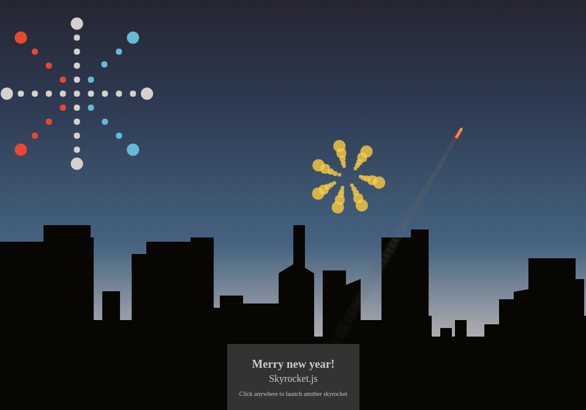
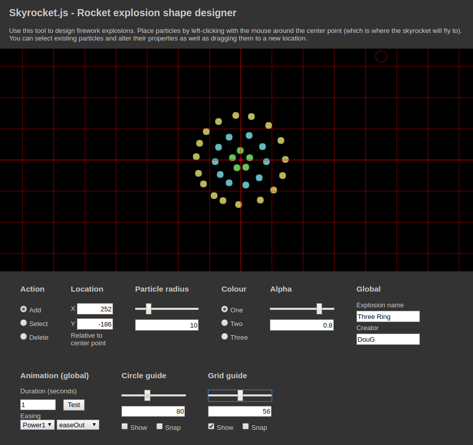

# javascript-skyrocket
Create fireworks on HTML canvas with Skyrocket.js

## Description
Skyrocket.js is a JavaScript library which displays skyrocket fireworks on HTML canvas. Skyrockets launch from the bottom center of the screen, fly up, explode, then fade. There is a code generated background of a city skyline which is different each time the page is loaded. The message at the bottom center of the screen can easily be changed to fit the occasion.

GreenSock's Animation Platform (GSAP) is used to power the rocket and explosion animations, the rest is plain JavaScript
so you should be able to include this library in any web project you like.

## Design your own Skyrockets!
One of the big features of this library is that you can create your own skyrockets using the visual designer

This allows you to visually design the explosion shapes and set the animation properties, then click a button to generate the JSON config needed by the skyrocket.js to use these in the fireworks show.

Note: place the generated config in skyrockets/explosions.js

Open tools/designer.html to get creating your own skyrocket explosions or edit existing ones.

Another important file is skyrockets/colors.js which defines sets of colours used by the rockets. Add your own or adjust the existing colours by specifying the RGB values for the colours.

## How to use
For an example of how to use this library, load the included index.html file in your browser.

A canvas must be included, along with the js files needed for the backdrop, skyrockets and their definition.

As you will see there is a function called addFirework() which is called repeatedly to spawn new fireworks at a random interval.

An explosion and colour are selected at random from those defined in skyrockets/colors.js and skyrockets/explosions.js

You could choose specific colours and explosions if desired to suit a particular occasion. You will likely need to create your own as well because there are only a small number of included types.

## Tutorials and other documentation
Sorry, there are none at this time. Currently this library is in a alpha state with the initial 0.0.1 created during a hackday. Please look at the included index.html and other source code for what is required and to read the comments.

The visual designer in tools/designer.html should be pretty straightforward to use, just follow the on-screen instructions.

## Maintainer
Douglas McKechie https://github.com/zarocknz

Keep informed about my JavaScript libraries by following https://twitter.com/dougtesting

## Credits
Special thanks to these people who collaborated with me on this during the hackday...

* Jaque van der Berg https://github.com/jaque777

* David Malone https://github.com/soulrolll

Also a big thank you to Catalyst http://www.catalyst.net.nz/ for having a hackday to celebrate 20 years and allowing us to get this open source library off off the ground.

## TODO
May include the following...

* Allow an image to be placed in the background of the designer (as a guide) which will make it easier to create complex shapes by "tracing" particles over the top.
* Allow explosion particles to have tails which are lines (will allow for more interesting shapes).
* Even more firework shapes and colour combinations.
* Allow images to be used for the rocket bodies?
* Add launch and explosion sounds, either pre-recorded or perhaps audio API generated?
* Simplify the use of the library even more, ensuring things are nice an configurable.
* Add the ability to queue up skyrockets in a particular order so can chain them to say particular messages such as "happy, 2018, everyone"
* Create some documentation and examples
